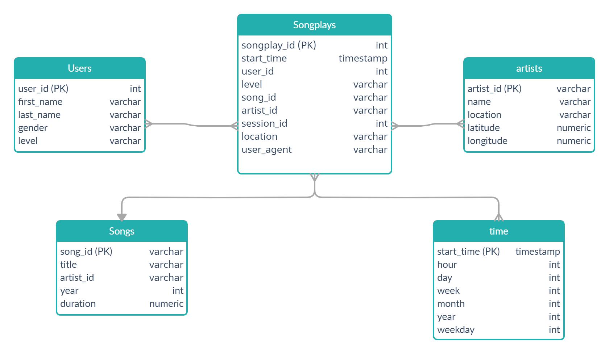

# Project: Data Modeling with Postgres
## Introduction
A startup called Sparkify wants to analyze the data they've been collecting on songs and user activity on their new music streaming app. The analytics team is particularly interested in understanding what songs users are listening to. Currently, they don't have an easy way to query their data, which resides in a directory of JSON logs on user activity on the app, as well as a directory with JSON metadata on the songs in their app.
### Task
I'm a data engineer and I need to create a Postgres database with tables designed to optimize queries on song play analysis. My role is to create a database schema and ETL pipeline for this analysis. Let's start) 

#### Database design
From this database we're planning to get answers for business demands by analizing songs that users are listening. That is why it is better to use a relational database (need to use aggregations) 

We will create a star sheme database (ER diagram created in https://creately.com/):

Songplays is a fact table, and 4 others are dimensional tables. 

ETL pipeline: load data from files in /data folder and insert the values in the relevant tables.

### How to run the Python scripts
1. Start Terminal.
2. Run **create_tables.py** to create database and tables.
3. Run **etl.py** to build ETL pipeline.
4. Run **test.ipynb** to confirm the creation of tables with the correct columns (*make sure to click "Restart kernel" to close the connection to the database after running this notebook*)

>NOTE: You will not be able to run **test.ipynb**, **etl.ipynb**, or **etl.py** until you have run **create_tables.py** at least once to create the sparkifydb database, which these other files connect to.

### Files in the repository
1. `test.ipynb` displays the first few rows of each table to let you check your database.
2. `create_tables.py` drops and creates your tables. You run this file to reset your tables before each time you run your ETL scripts.
3. `etl.ipynb` reads and processes a single file from song_data and log_data and loads the data into your tables. This notebook contains detailed instructions on the ETL process for each of the tables.
4. `etl.py` reads and processes files from song_data and log_data and loads them into your tables. You can fill this out based on your work in the ETL notebook.
5. `sql_queries.py` contains all your sql queries, and is imported into the last three files above.
6. `README.md` provides discussion on your project.
7. `star_shema2.jpg` is ER diagram of star shema database.
8. `Examples.ipynb` queries and results for song play analysis

### Examples
In `Examples.ipynb` you can find two examples of what information we can get for analysis.